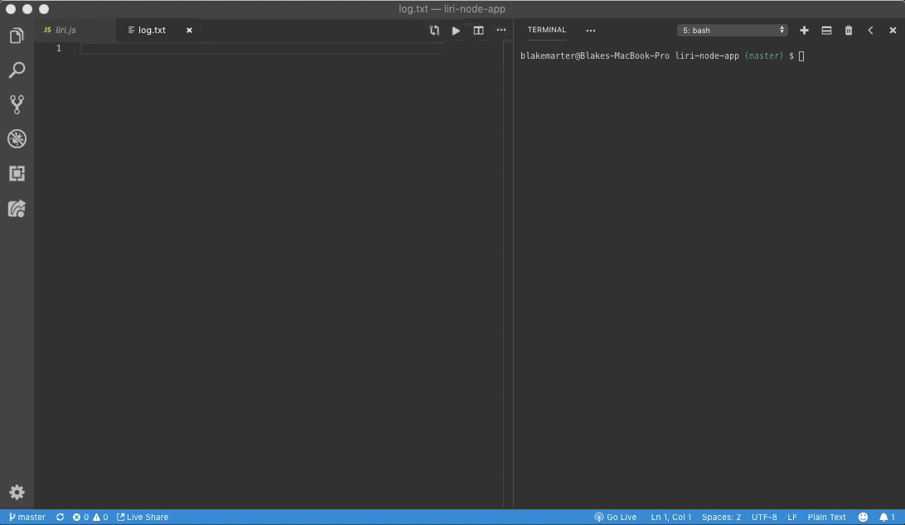
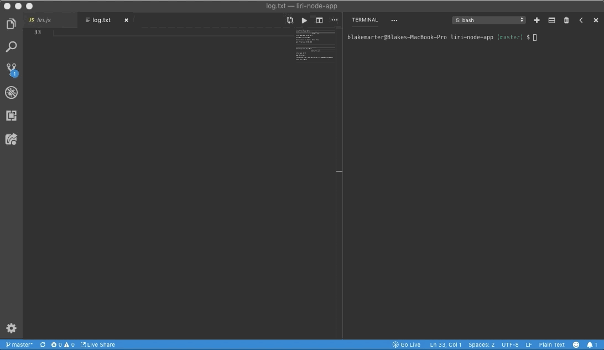
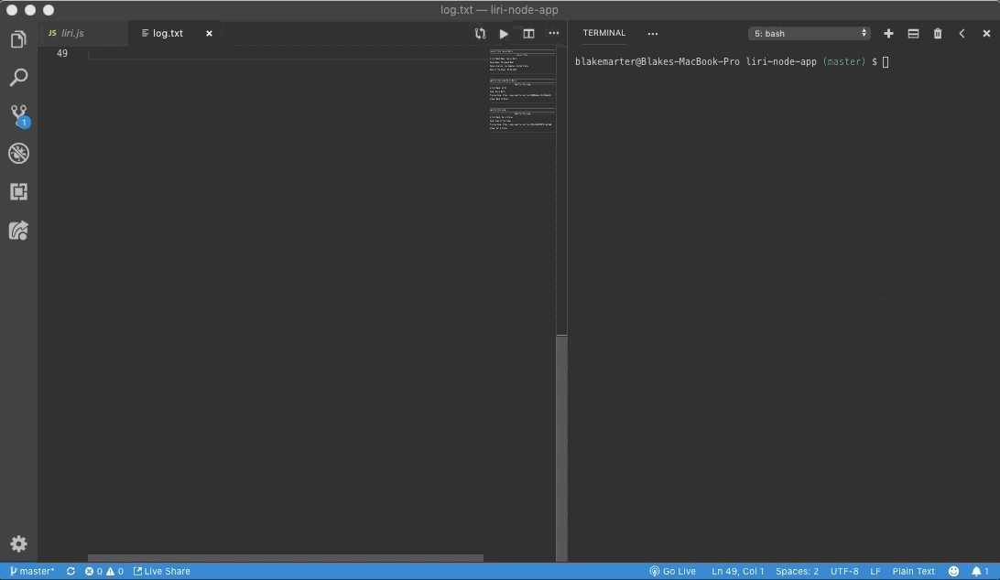

# __LIRI app__

## __Table of Contents__
* Overview
* Technologies
* Local Installation
* Demo

## __Overview__
  LIRI is like iPhone's SIRI. However, while SIRI is a Speech Interpretation and Recognition Interface, LIRI is a _Language_ Interpretation and Recognition Interface. LIRI will be a command line node app that takes in parameters and gives you back data.
  
  Cammands allowed by the LIRI app:

  - `node liri.js concert-this <Artist/band name>`
    
    This will search the Bands in Town Artist Events API (`"https://rest.bandsintown.com/artists/" + artist    + "/events?app_id=codingbootcamp"`) for an artist and render the following information about each event    to the terminal:
     * Name of the venue
     * Venue location
     * Date of the Event (use moment to format this as "MM/DD/YYYY")

  - `node liri.js spotify-this-song <Song name here>`
     
     This will show the following information about the song in your terminal/bash window
     * Artist(s)
     * The song's name
     * A preview link of the song from Spotify
     * The album that the song is from

  - `node liri.js spotify-this-song`

     If no song is provided then your program will default to "The Sign" by Ace of Base.

  - `node liri.js movie-this <Movie title here>`

     This will output the following information to your terminal/bash window:
     * Title of the movie.
     * Year the movie came out.
     * IMDB Rating of the movie.
     * Rotten Tomatoes Rating of the movie.
     * Country where the movie was produced.
     * Language of the movie.
     * Plot of the movie.
     * Actors in the movie.

  - `node liri.js movie-this`
    
     If the user doesn't type a movie in, the program will output data for the movie 'Mr. Nobody.'

  - `node liri.js do-what-it-says`
     
     This will run `spotify-this-song` for "I Want it That Way," as follows the text in `random.txt`.

## __Technologies__
* JavaScript
* Node.js
* #### __NPM Requirements__
  - dotenv
  - fs
  - axios
  - moment
  - node-spotify-api
   ```
   require("dotenv").config();
   var keys = require("./keys.js");
   var Spotify = require("node-spotify-api");
   var spotify = new Spotify(keys.spotify);
   var fs = require("fs");
   var axios = require("axios");
   var moment = require("moment");
   ```

## __Local Installation__
* #### __Step 1: Git Clone__
    Clone the LIRI app to your local computer by opening your terminal, navigating to the folder you want to store it in and input:
    ```
    git clone https://github.com/BlakeMarter/liri-node-app.git
    ```
    The LIRI app and its files should now be in your project folder.


 * #### __Step 2: Install Reaquired NPM's__
  
      - Navigate to the correct JS file in your terminal and input `npm install` or `npm i`.

## __Demo__

Once you have everything installed, typing the following commands will give you suprising results!

- Example input `node liri.js concert-this tauren wells`

  

- Example input `node liri.js spotify-this-song hells bells`

  

- Example input `node liri.js spotify-this-song`

  

- Example input `node liri.js movie-this the office`

  

- Example input `node liri.js movie-this`  

  

- Example input `node liri.js do-what-is-says`

  
